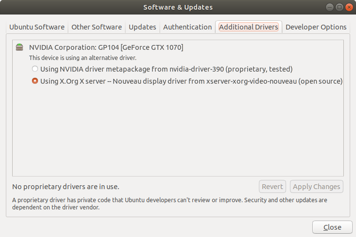
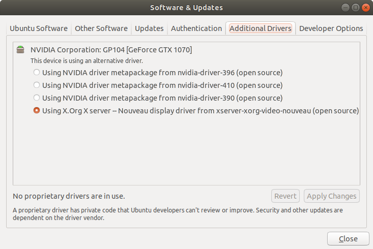
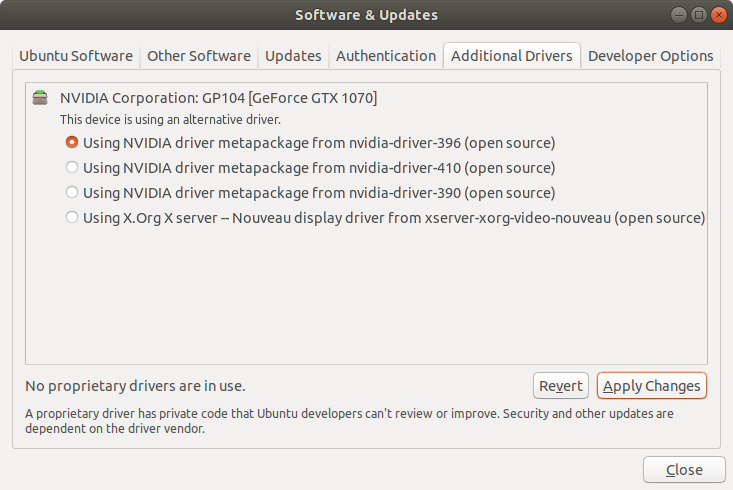
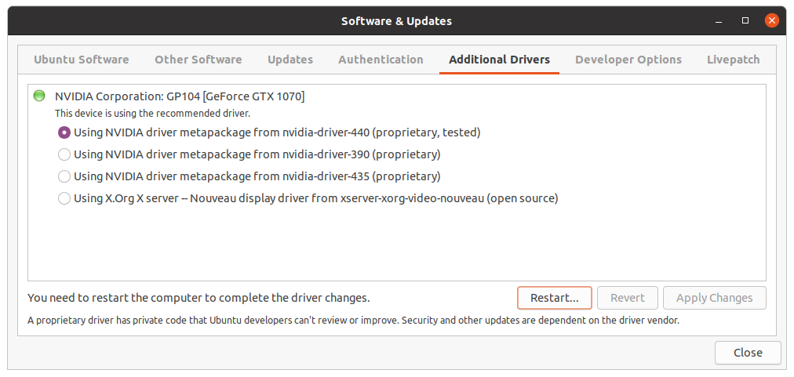

# Setup of TensorFlow 2 GPU, Keras and PyTorch with CUDA, cuDNN and CUPTI using Conda on Ubuntu 20.04 -- the easy way! #

*2020-05-13*

A lot of documents on the web describe the manual installation of CUDA, CuDNN and TensorFlow with GPU support. The problem with the manual installation is that the right versions of NVIDIA driver, CUDA, CuDNN and TensorFlow need to be combined. Thus the manual installation will often fail. But there is a solution: Conda can take care of the installation of the requirements for TensorFlow 2 with GPU support. Conda can install CUDA, CuDNN and the other requirements. Here are the steps it took me to get TensorFlow and PyTorch to run with GPU support on a freshly installed Ubuntu 20.04 desktop machine.

## Backup? ##
I am using a freshly installed Ubuntu 20.04 so I don't have the need for a back up. Otherwise I would create a back up of my system before I proceed.

## Install a suitable NVIDIA driver ##
First I want to be sure that my system is up to date:

```
sudo apt update
sudo apt dist-upgrade
sudo reboot now
```

Open *Software & Updates* and select the *Additional Drivers* tab:



A clean Ubuntu 20.04 installed on hardware with NVIDIA GPU uses the Nouveau display driver.  Tensorflow with GPU support requires an NVIDIA driver. So I select the *nvidia-driver-440* and click *Apply Changes*:



I wait while the driver is being installed:



I click *Restart*:



To verify that the NVIDIA driver 396 is active I call:
```
nvidia-smi
```
This should result in an output like this:
```
Wed May 13 16:29:56 2020       
+-----------------------------------------------------------------------------+
| NVIDIA-SMI 440.64       Driver Version: 440.64       CUDA Version: 10.2     |
|-------------------------------+----------------------+----------------------+
| GPU  Name        Persistence-M| Bus-Id        Disp.A | Volatile Uncorr. ECC |
| Fan  Temp  Perf  Pwr:Usage/Cap|         Memory-Usage | GPU-Util  Compute M. |
|===============================+======================+======================|
|   0  GeForce GTX 1070    Off  | 00000000:01:00.0  On |                  N/A |
|  0%   45C    P8    16W / 151W |    226MiB /  8097MiB |      0%      Default |
+-------------------------------+----------------------+----------------------+
                                                                               
+-----------------------------------------------------------------------------+
| Processes:                                                       GPU Memory |
|  GPU       PID   Type   Process name                             Usage      |
|=============================================================================|
|    0      1290      G   /usr/lib/xorg/Xorg                            53MiB |
|    0      1965      G   /usr/lib/xorg/Xorg                            62MiB |
|    0      2172      G   /usr/bin/gnome-shell                          96MiB |
+-----------------------------------------------------------------------------+
```
## Install Anaconda ##

**I proceed as the user that I want to use later to work with TensorFlow and PyTorch. I don't use sudo!** 

I download *Anaconda* from https://www.anaconda.com/download/. The I open a new terminal. 

```
bash Anaconda3-2020.02-Linux-x86_64.sh 
```

I accept the license terms and confirm the location. 

## Installing TensorFlow 2 and PyTorch

Currently TensorFlow 2 works only with Python 3.7 and CUDA 10.1 while PyTorch can work with Python 3.7 and 3.8 and CUDA 10.1 and 10.2. So I see three possibible solutions:

1. Install each with the latest supported versions in a separate environment.
2. Install both in a single environment. Install TensorFlow first and then PyTorch, so conda will use the versions already installed for TensorFlow.
3. Install both in a single environment. Install PyTorch first while explicitly stating that it has to be installed with CUDA 10.1 and Python 3.7 and then install TensorFlow. 

I choose 2. because I want TensorFlow and PyTorch in a single environment and I don't want to mess around with version numbers.

### Create an environment

**Again: I still use the user that I want to use later to work with TensorFlow and PyTorch. I don't use sudo!** 

Now I reopen the terminal window!

I create a virtual environment. For this example I choose the name *dl* as abbreviation for *Deep Learning*.

```
conda create --name dl
```

I activate the environment!

```
conda activate dl
```

### Install TensorFlow

Now I install TensorFlow with GPU support.

```
conda install tensorflow-gpu
```

The package list includes:

```
  cudatoolkit        pkgs/main/linux-64::cudatoolkit-10.1.243-h6bb024c_0
  cudnn              pkgs/main/linux-64::cudnn-7.6.5-cuda10.1_0
  cupti              pkgs/main/linux-64::cupti-10.1.168-0         
```

Thus there is no need to download these libraries from NVIDIA and install them manually. Conda did the work and conda also took care that the right versions were installed.

### Install PyTorch

I also install PyTorch, see also https://pytorch.org/ :

```
conda install pytorch torchvision -c pytorch
```
## Test if GPU is available ##

I open a console, activate the environment and start python:
```
conda activate dl
python
```
### Test Tensorflow ###
I use the test from https://www.tensorflow.org/guide/using_gpu. I enter the following code in the python console:
```
import tensorflow as tf
print("Num GPUs Available: ", len(tf.config.experimental.list_physical_devices('GPU')))
```
The output should contain:
```
Num GPUs Available:  1
```

## Test PyTorch ##
I enter the following code in the python console:
```
import torch
torch.cuda.get_device_name(torch.cuda.current_device())
```
The output contains the name of my graphics card:
```
'GeForce GTX 1070'
```
